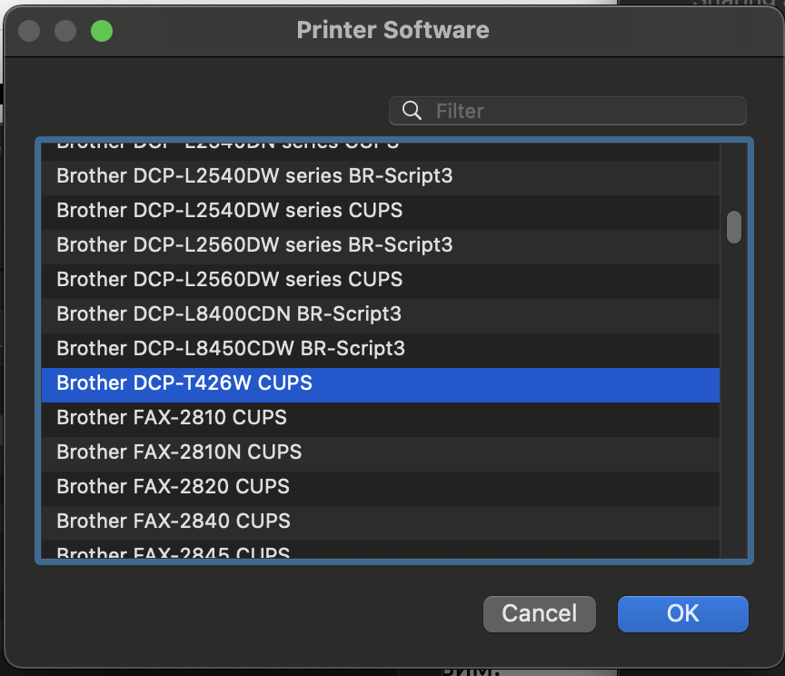

# "Creating" a macOS driver and adding support of AirPrint™ and IPP Everywhere™ for the budget printer Brother DCP-T426W

The Brother DCP-T426W is an affordable ink tank printer that lacks native macOS drivers. Brother recommends using their iPrint&Scan software for macOS compatibility.
Additionally, this model does not support AirPrint. We will attempt to resolve these issues.

The drivers are the easiest part to address. We can use drivers from the Brother DCP-T425W or DCP-T400 models and download the driver package from the Brother website:
https://www.brother.cn/project/d2/Brother_PrinterDrivers_Inkjet19_101.dmg

If your inner perfectionist prefers a tailored solution, we can easily 'create' a driver specifically for the DCP-T426W.

1. Let's download the driver package from the provided link https://www.brother.cn/project/d2/Brother_PrinterDrivers_Inkjet19_101.dmg

```bash
wget https://www.brother.cn/project/d2/Brother_PrinterDrivers_Inkjet19_101.dmg
```

2. Extract the contents of the Brother_PrinterDrivers_Inkjet19_101.dmg file using 7z:

```bash
7z x Brother_PrinterDrivers_Inkjet19_101.dmg
```

3. Inside, you'll find the package file `Brother_PrinterDrivers_Inkjet19.pkg`. Extract its contents:

```bash
mkdir drivers && xar -x -f Brother_PrinterDrivers_Inkjet19.pkg -C ./drivers
```

4. In the folder `drivers/Brother_PrinterDrivers_Inkjet19.pkg`, locate the file named `Payload` and extract it as well:

```bash
tar zxvf Payload
```

5. In the folder `Library/Printers/PPDs/Contents/Resources` you will find the driver files, decompress them:

```bash
gzip -d *.gz
```

6. When comparing the files for the DCP-T42x models, we will find that they are identical except for the model name in fields such as  Product, 1284DeviceID, NickName: 

```bash
diff Brother\ DCP-T420W\ CUPS Brother\ DCP-T425W\ CUPS
diff Brother\ DCP-T425W\ CUPS Brother\ DCP-T428W\ CUPS
```

7. We can now create a driver file specifically for the DCP-T426W model:

```bash
sed 's/DCP-T428W/DCP-T426W/g' Brother\ DCP-T428W\ CUPS > Brother\ DCP-T426W\ CUPS
```

8. Let's create the PPD file, as it will be needed later for OpenPrinting CUPS:

```bash
cp Brother\ DCP-T426W\ CUPS Brother_DCP-T426W.ppd
```

9. Create an archive of the newly created driver:

```bash
gzip Brother\ DCP-T426W\ CUPS
```

10. You can then install the driver from the command line:

```bash
sudo cp ./Brother\ DCP-T426W\ CUPS.gz /Library/Printers/PPDs/Contents/Resources
```

11. and find it listed under Printer Software:

    

12. To add support for AirPrint™ and IPP Everywhere™, you need to install OpenPrinting CUPS on a Raspberry Pi, Docker container, or any Linux system of your choice.
You will need to configure it as described below and use the Brother_DCP-T426W.ppd file created in Step 8.

    * https://www.developer.com/mobile/cups-and-raspberry-pi-airprinting/
    * https://www.linuxbabe.com/ubuntu/set-up-cups-print-server-ubuntu-bonjour-ipp-samba-airprint

As a result, we have a macOS driver and support of AirPrint™ and IPP Everywhere™, allowing printing from an iPhone or iPad without the need for the Brother iPrint&Scan app.
The driver and PPD file can be found in the [drivers](./drivers) folder.
